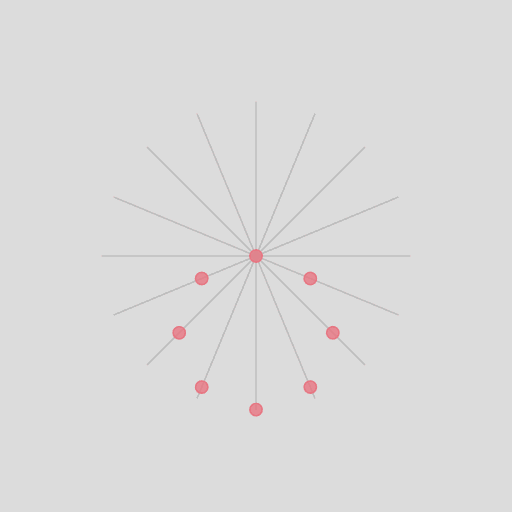

# Circle Illusion

This is a small p5.js sketch that showcases a visual illusion, creating an interesting effect where points moving in straight lines appear to form a rotating circle. I created it after getting inspired by [this video](https://www.youtube.com/watch?v=pNe6fsaCVtI) by *brusspup*, although I don't know where the illusion originally appeared first. I expanded on the idea and added some intractability that lets you play around with some parameters creating even more cool effects.



#### Demo
You can try the effect yourself in your browser by visiting the [live demo page](https://arualdev.github.io/circle-illusion).

#### Usage
If you want to run the sketch locally or play with the code yourself, you can simply clone the repository:

```shell
git clone https://github.com/ArualDev/circle-illusion.git
cd circle-illusion
```
There are no dependencies needed. You can run the sketch just by opening the `index.html` file in your browser.